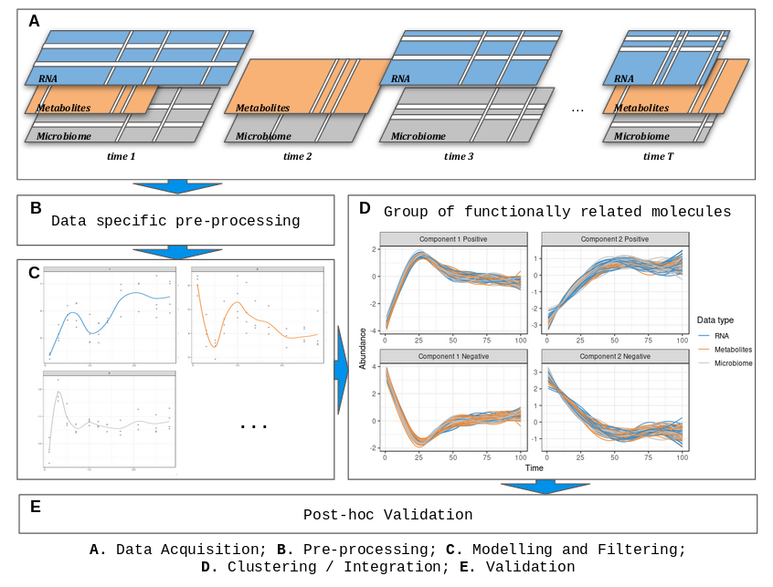

[](https://travis-ci.com/abodein/timeOmics_BioC)
[](https://codecov.io/gh/abodein/timeOmics_BioC)
[](https://www.gnu.org/licenses/gpl-3.0)

# timeOmics

***timeOmics*** is a generic data-driven framework to integrate multi-Omics longitudinal data (**A.**) measured on the same biological samples and select key temporal features with strong associations within the same sample group.



The main steps of ***timeOmics*** are:

* a pre-processing step (**B.**) Normalize and filter low-expressed features, except those not varying over time,
* a modelling step (**C.**)  Capture inter-individual variability in biological/technical replicates and accommodate heterogeneous experimental designs,
* a clustering step (**D.**) Group features with the same expression profile over time. Feature selection step can also be used to identify a signature per cluster,
* a post-hoc validation step (**E.**) Ensure clustering quality.

***timeOmics*** can be applied on both single-Omic or multi-Omics experimental design.

## Installation

### Latest `GitHub` Version

Install the devtools package in R, then load it and install the latest stable version of `timeOmics` from `GitHub`

```r
## install devtools if not installed
if (!requireNamespace("devtools", quietly = TRUE))
    install.packages("devtools")
## install timeOmics
devtools::install_github("abodein/timeOmics_BioC")
```

## Citing

*Bodein A, Chapleur O, Droit A and Lê Cao K-A (2019) A Generic Multivariate Framework for the Integration of Microbiome Longitudinal Studies With Other Data Types. Front. Genet. 10:963. <a href="http://dx.doi.org/10.3389/fgene.2019.00963"> doi:10.3389/fgene.2019.00963</a>*

## Maintainer
Antoine Bodein (<antoine.bodein.1@ulaval.ca>)

## Bugs/Feature requests

If you have any bugs or feature requests, [let us know](https://github.com/abodein/timeOmics_BioC/issues). Thanks!
