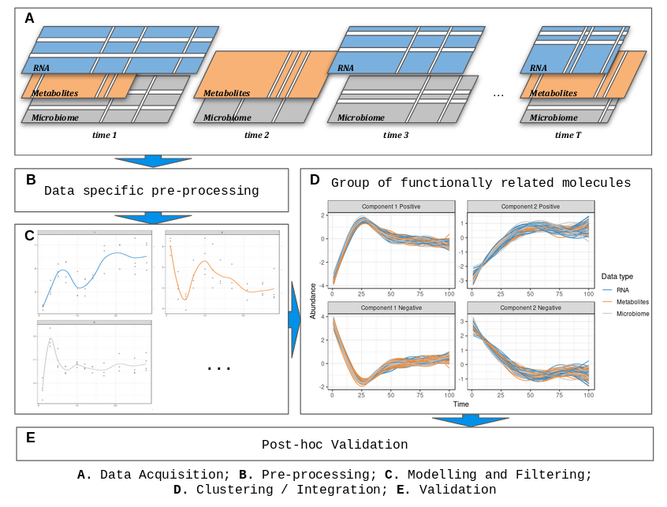

# Introduction

***timeOmics*** is a generic data-driven framework to integrate multi-Omics longitudinal data (**A.**) measured on the same biological samples and select key temporal features with strong associations within the same sample group.

The main steps of ***timeOmics*** are:

* a pre-procesing step (**B.**) to normalize and filter low-expressed and not time-varying features,
* a modelling step (**C.**) to capture inter-individual variability in biological/technical replicates.
* a clustering step (**D.**) to group features with the same expression profile over time. We can also use a feature selection step to identify a signature per cluster.
* a post-hoc validation step (**E.**) to ensure clustering quality.

We present this framework on both single-Omic and multi-Omics situations.



For more details please check:  
*Bodein A, Chapleur O, Droit A and Lê Cao K-A (2019) A Generic Multivariate Framework for the Integration of Microbiome Longitudinal Studies With Other Data Types. Front. Genet. 10:963. doi: 10.3389/fgene.2019.00963*

# Start

## Installation

```{r, echo =  FALSE}
knitr::opts_chunk$set(eval = TRUE, 
                      echo = TRUE,
                      fig.align = "center",
                      warning = FALSE,
                      message = FALSE)
```


```r
install.packages("devtools")
# then load
library(devtools)
install_github("abodein/timeOmics_BioC")
```

## Load the package

```{r, message=FALSE, warning=FALSE}
library(timeOmics)
```

## Useful packages to run this vignette

```{r}
library(lmms)
library(tidyverse)
```

# Required data

Each omics technology produces abundance tables with samples in rows and features in columns (genes, proteins, species, ...).
In multi-Omics, each *block* has the same rows and a variable number of columns depending on the technology and number of identified features.

We assume each block is a matrix/data.frame with samples in rows (similar in each block) and features in columns (variable number of column).

For this example, we will use simulated data based on the above-mentioned article.

```{r}
data("timeOmics.simdata")
?timeOmics.simdata
sim.data <- timeOmics.simdata$sim

dim(sim.data) 
head(sim.data[,1:6])
```


# Data preprocessing

Every analysis starts with a pre-processing step. 
In longitudinal multi-omics analysis we have a 2-step pre-processing procedure.

## Omic-specific

Omic-specific pre-processing is the type of standardization normally used without time component.
It may differ depending on the type of technology
*(log, scale, rle, low count removal, ...)*.
That is why we let the user apply his favorite method of standardization.

## Time-specific

In a longitudinal context, one can be interested only in features that vary over time and filter out molecules that would have a negligible impact on the system.

To do so, we can first naively set a threshold on the variation coefficient and keep those features that exceed the threshold.

```{r}
remove.low.cv <- function(X, cutoff = 0.5){
  # var.coef
  cv <- unlist(lapply(as.data.frame(X), 
                      function(x) abs(sd(x)/mean(x))))
  return(X[,cv > cutoff])
}

data.filtered <- remove.low.cv(sim.data, 0.5)
```


# Time Modelling

We rely on a *Linear Mixed Model Splines* framework (package `lmms`) to model features expression as a function of time by taking into account all inter-individual variability.

`lmms` framework tests 4 different models and assigns one of the following models to each feature:

* 0 = linear model, 
* 1 = linear mixed effect model spline (LMMS) with defined basis, 
* 2 = LMMS taking subject-specific random intercept, 
* 3 = LMMS with subject specific intercept and slope.

The package also has an interesting feature for filtering profiles not differentially expressed over time, in a more robust way (see `lmms::lmmsDE`).

At the end, `lmms` summarize each feature into a unique time profile.

## `lmms` example

`lmms` requires a dataframe with features in columns and samples in rows.

For more information about `lmms` modelling parameters, please check \code{\link[lmms]{lmms}}

```{r, message=FALSE}
time <- rownames(data.filtered) %>% str_remove("._") %>% as.numeric()
lmms.output <- lmms::lmmSpline(data = data.filtered, time = time,
                        sampleID = rownames(data.filtered), deri = FALSE,
                        basis = "p-spline", numCores = 4, timePredict = 1:9, 
                        keepModels = TRUE)
modelled.data <- t(slot(lmms.output, 'predSpline'))
```

The produced table contains features in columns and now, times in rows.
Let's plot the modelled profiles.

```{r}
# gather data
data.gathered <- modelled.data %>% as.data.frame() %>% 
  rownames_to_column("time") %>%
  mutate(time = as.numeric(time)) %>%
  pivot_longer(names_to="feature", values_to = 'value', -time)

# plot profiles
ggplot(data.gathered, aes(x = time, y = value, color = feature)) + geom_line() +
  theme_bw() + ggtitle("`lmms` profiles") + ylab("Feature expression") +
  xlab("Time")
```

## Profile filtering

Straight line modelling can occur when the inter-individual variation is too high.
To remove the noisy profiles, we have implemented a 2-phase test procedure.

* *Breusch-Pagan test*, which tests the homo-sedasticity of the residues.
* *cutoff on MSE* (mean squared error), to reduce dispersion of the residues around the line.

```{r}
filter.res <- lmms.filter.lines(data = modelled.data, lmms.obj = lmms.output, time = time)
profile.filtered <- filter.res$filtered
```

# Single-Omic longitudinal clustering

## Principal Component Analysis

From the modelled data, we use a PCA to cluster features with a samilar expression profile over time.

PCA is un unsupervised reduction dimension technique which use uncorrelated 
intrumental variable (a.k.a principal components) to summarize as much information 
(*variance*) as possible from the data.

*(see also \code{\link[mixOmics]{pca}} for more details about `pca` and available options)*


### Clustering

Clusters of similar expression profiles are grouped as follows

In PCA, components are generated using variables. Each variable can either contribute positively or negatively to the creation of the components.
Each variable (feature) will be associated with a component (the one that most represents it).
Finally, each component can create 2 clusters and each feature is assigned to a cluster according to the maximum contribution on a component and the sign of that contribution.

To optimize the number of clusters, the number of PCA components needs to be optimized first.
The quality of clustering is assessed using the silhouette coefficient.
The number of components that maximizes the silhouette coefficient will provide the best clustering.

```{r}
# run pca
pca.res <- pca(X = profile.filtered, ncomp = 5, scale=FALSE)

# tuning ncomp
pca.ncomp <- getNcomp(pca.res, max.ncomp = 5, X = profile.filtered, scale = FALSE, center=FALSE)

pca.ncomp$choice.ncomp
plot(pca.ncomp)
```

Thanks to the previous plot, highest silhouette coefficient is achieved when `ncomp = 2`(4 clusters).

```{r}
# final model
pca.res <- pca(X = profile.filtered, ncomp = 2, scale = FALSE, center=FALSE)
```

All information about the cluster is displayed below.

```{r}
# extract cluster
pca.cluster <- getCluster(pca.res)
head(pca.cluster)
```

### Plot PCA clusters

```{r}
#mixOmics::plotVar(pca.res)
plotLong(pca.res, scale = FALSE, center = FALSE, title = "PCA longitudinal clustering")
```


## *sparse* PCA

The previous clustering used all features. Sometimes we are interested in a cluster signature.
We then use the sparse PCA to extract this key signature.

*(see also \code{\link[mixOmics]{spca}} for more details about `spca` and available options)*

### `keepX` optimization

To find the right number of features to keep per component (`keepX`) and thus per cluster, silhouette coefficient is assessed for a list of selected features on each component.

Evolution of silhouette coefficient of each cluster (component and contribution) is observed to 
detect a significant decrease in the silhouette for each component.

We do not recommend using a parameter that is too small since it will tend to pull the silhouette coefficient upwards and bias the interpretation regarding the number of features to be selected.


```{r}
tune.spca.res <- tuneCluster.spca(X = profile.filtered, ncomp = 2, test.keepX = c(2:10))
tune.spca.res$choice.keepX
plot(tune.spca.res)
```


```{r}
spca.res <- spca(X = profile.filtered, ncomp = 2, keepX = tune.spca.res$choice.keepX, scale = FALSE)
plotLong(spca.res)
```


# multi-Omics longitudinal clustering 

The clustering strategy with more than one block of data is the same as longitudinal clustering with PCA and is based on the projection of variables on a reduced common space.

With 2 blocks, it is then necessary to use PLS.
With more than 2 blocks, the user has to use a multi-block PLS.


## Projection on Latent Structures (PLS)

In the following section, *PLS* is used to cluster time profiles coming from 2 blocks of data.
*PLS* accepts 2 data.frames with the same number of rows (corresponding samples).

*(see also \code{\link[mixOmics]{pls}} for more details about `pls` and available options)*

### Ncomp and Clustering 

Like *PCA*, number of components of PLS model and thus number of clusters needs to be optimized.

```{r}
X <- profile.filtered
Y <- timeOmics.simdata$Y

pls.res <- pls(X,Y, ncomp = 5, scale = FALSE)
pls.ncomp <- getNcomp(pls.res, max.ncomp = 5, X=X, Y=Y, scale = FALSE)
pls.ncomp$choice.ncomp
plot(pls.ncomp)
```

Thanks to the previous plot, highest silhouette coefficient is achieved when `ncomp = 2`(4 clusters).


```{r}
# final model
pls.res <- pls(X,Y, ncomp = 2, scale = FALSE)

getCluster(pls.res) %>% head
plotLong(pls.res, title = "PLS longitudinal clustering")
```

### Signature with *sparse* PLS

As with *PCA*, it is possible to use the *sparse* PLS to get a signature of the clusters.

`tuneCluster.spls` choose the correct number of feature to keep on block X `keepX` as well as 
the correct number of feature to keep on block Y `keepY` among a list provided by the user.

*(see also \code{\link[mixOmics]{spls}} for more details about `spls` and available options)*

```{r}
tune.spls <- tuneCluster.spls(X, Y, ncomp = 2, test.keepX = c(4:10), test.keepY <- c(2,4,6))
tune.spls$choice.keepX
tune.spls$choice.keepY

# final model
spls.res <- spls(X,Y, ncomp = 2, scale = FALSE, 
                 keepX = tune.spls$choice.keepX, keepY = tune.spls$choice.keepY)
# spls cluster
spls.cluster <- getCluster(spls.res)

# longitudinal cluster plot
plotLong(spls.res, title = "sPLS clustering")
```

## Multi-block (s)PLS longitudinal clustering

With more than 2 blocks of data, it is necessary to use *multi-block PLS* to identify cluster of similar profile coming from 3 and more blocks of data.

This methods accepts a list of data.frame as `X` (same corresponding rows) and a Y data.frame.

*(see also \code{\link[mixOmics]{block.pls}} for more details about `block.pls` and available options)*

### Ncomp and Clustering 

```{r}
X <- list("X" = profile.filtered, "Z" = timeOmics.simdata$Z)
Y <- as.matrix(timeOmics.simdata$Y)

block.pls.res <- block.pls(X=X, Y=Y, ncomp = 5, scale = FALSE, mode = "canonical")
block.ncomp <- getNcomp(block.pls.res,X=X, Y=Y, scale = FALSE, mode = "canonical")
block.ncomp$choice.ncomp
plot(block.ncomp)
```

Thanks to the previous plot, highest silhouette coefficient is achieved when `ncomp = 1`(2 clusters).

```{r}
# final model
block.pls.res <- block.pls(X=X, Y=Y, ncomp = 1, scale = FALSE, mode = "canonical")
# block.pls cluster
block.pls.cluster <- getCluster(block.pls.res)

# longitudinal cluster plot
plotLong(block.pls.res)
```

### Signature with multi-block *sparse* PLS

As with *PCA* and *PLS*, it is possible to use the *sparse* multi-block PLS to get a signature of the clusters.

`tuneCluster.block.spls` choose the correct number of feature to keep on each block of X `keepX` as well as 
the correct number of feature to keep on block Y `keepY` among a list provided by the user.

*(see also \code{\link[mixOmics]{block.spls}} for more details about `block.spls` and available options)*


```{r}
test.list.keepX <- list("X" = 4:10, "Z" = c(2,4,6,8))
test.keepY <- c(2,4,6)

tune.block.res <- tuneCluster.block.spls(X= X, Y= Y, test.list.keepX=test.list.keepX, test.keepY= test.keepY, scale=FALSE, mode = "canonical", ncomp = 1)
tune.block.res$choice.keepX
tune.block.res$choice.keepY

# final model
block.pls.res <- block.spls(X=X, Y=Y, ncomp = 1, scale = FALSE, mode = "canonical", keepX = tune.block.res$choice.keepX, keepY = tune.block.res$choice.keepY)
head(getCluster(block.pls.res))
plotLong(block.pls.res)
```


# Post-hoc evaluation

Interpretation based on correlations between profiles must be made with caution as it is highly likely to be
spurious. Proportional distances has been proposed as an alternative to measure association.

In the following graphs, we represent all the proportionality distance $\varphi_s$ within clusters and the distance of features inside the clusters with entire background set.

We also use a Wilcoxon U-test to compare the within cluster median compared to the entire background set.


```{r, eval=TRUE}
# example fro multiblock analysis
res <- timeOmics::proportionality(block.pls.res)
# distance between pairs of features
head(res$propr.distance)[1:6]
# u-test pvalue by clusters
pval.propr <- res$pvalue 
knitr::kable(pval.propr)
plot(res)
```
